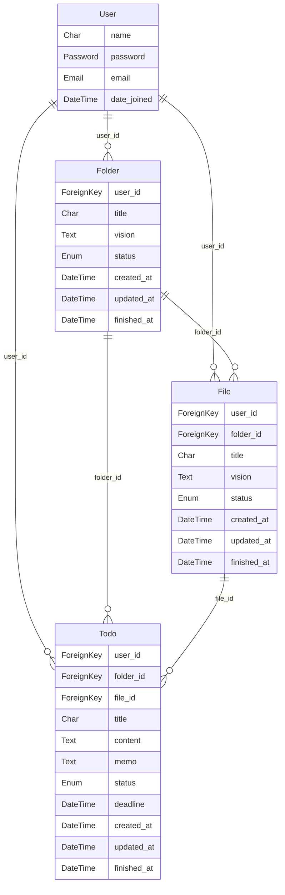

```mermaid
erDiagram
    User ||--o{Folder: "user_id"

    User ||--o{File: "user_id"
    Folder ||--o{File: "folder_id"

    User ||--o{Todo: "user_id"
    Folder ||--o{Todo: "folder_id"
    File ||--o{Todo: "file_id"

    User {
        Char name
        Password password
        Email email
        DateTime date_joined
    }

    Folder {
        ForeignKey user_id
        Char title
        Text vision
        Enum status
        DateTime created_at
        DateTime updated_at
        DateTime finished_at
    }

    File {
        ForeignKey user_id
        ForeignKey folder_id
        Char title
        Text vision
        Enum status
        DateTime created_at
        DateTime updated_at
        DateTime finished_at
    }

    Todo {
        ForeignKey user_id
        ForeignKey folder_id
        ForeignKey file_id
        Char title
        Text content
        Text memo
        Enum status
        DateTime deadline
        DateTime created_at
        DateTime updated_at
        DateTime finished_at
    }
```
